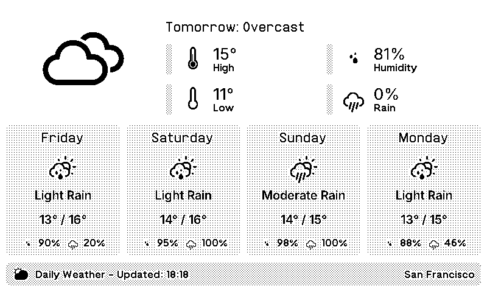

# TRMNL Daily Weather Plugin

A weather forecast plugin for TRMNL devices that displays current conditions and a 5-day forecast using the OpenWeatherMap API.

## Features

- **5-Day Forecast**: Shows today's weather plus 4 additional forecast days
- **Detailed Weather Conditions**: Displays specific conditions like "Light Rain", "Heavy Rain", "Overcast", etc.
- **Multiple Layouts**: Supports full, half horizontal, half vertical, and quadrant display modes
- **Timezone Aware**: Automatically adjusts for the forecast location's timezone
- **Smart Weather Icons**: Priority-based icon selection that considers all forecast entries for each day
- **Accurate Daily Data**: Calculates true daily min/max temperatures and precipitation from all forecast periods

## Configuration

### Required Settings

- **OpenWeather API Key**: Get your API key with One Call API 3.0 subscription at [OpenWeatherMap](https://openweathermap.org/api/one-call-3)
- **Latitude**: The latitude of your location
- **Longitude**: The longitude of your location

### Optional Settings

- **Temperature Unit**: Choose between Celsius or Fahrenheit
- **Location Name**: Display name for the location (shown in title bar)

## Weather Data

The plugin displays:
- Current weather conditions with appropriate icons
- Daily high/low temperatures
- Humidity levels
- UV Index
- Precipitation probability
- 5-day extended forecast

## API Information

- **Data Source**: OpenWeatherMap One Call API 3.0
- **Update Frequency**: Every 12 hours (720 minutes)
- **Timezone Support**: Uses location-specific timezone for accurate forecasting

## Installation

1. Get your OpenWeatherMap API key with One Call API 3.0 subscription
2. Import the plugin ZIP file into your TRMNL dashboard
3. Configure your location coordinates and API key
4. Select your preferred temperature unit
5. Add an optional location name for identification

## Weather Conditions Supported

The plugin recognizes and displays detailed weather conditions including:
- Clear, Few Clouds, Scattered Clouds, Overcast
- Light Rain, Moderate Rain, Heavy Rain, Extreme Rain
- Light Drizzle, Drizzle, Showers
- Light Snow, Snow, Heavy Snow, Sleet
- Thunderstorms, Lightning, Storms
- Fog, Mist, Haze, Smoke, Dust
- And many more specific conditions

## About

This plugin is designed for use with TRMNL devices and uses the OpenWeatherMap API for weather data.